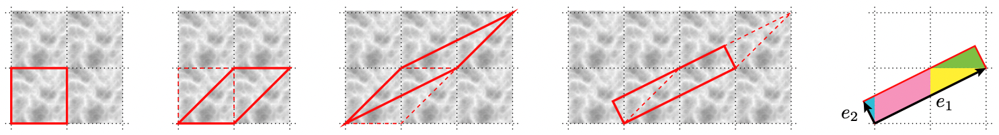
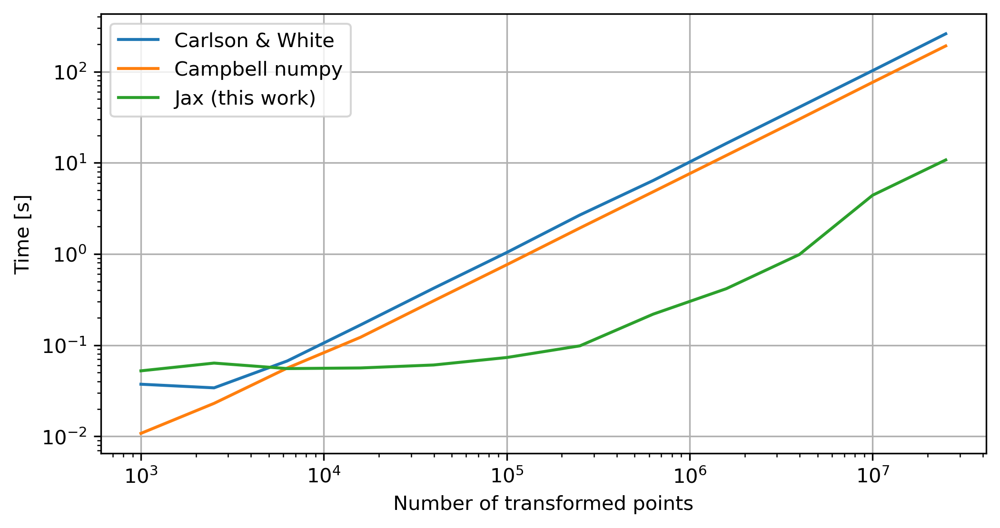

# Cuboid Remapping in Jax
This is a Jax implementation of cuboid remapping ([Carlson & White 2010](https://ui.adsabs.harvard.edu/abs/2010ApJS..190..311C)), an algorithm to remap cubic volumes with periodic boundary conditions to cuboid domains.


Image credit: Carlson & White 2010

This repository is a rewrite of Duncan Campbell's numpy version ([link](https://github.com/duncandc/cuboid_remap)), which itself was a rewrite of Carlson & White's original implementation ([link](http://mwhite.berkeley.edu/BoxRemap/)). Any use of this code should cite the original implementation ([Carlson & White 2010](https://ui.adsabs.harvard.edu/abs/2010ApJS..190..311C)).

Almost all algorithmic details of the code remain the exact same as the original implementation, including the tesselation of the unit box and construction of the cuboid domain. The main difference is in the implementation Cuboid.Transform function, which has been made more efficient through vectorization with [Jax](https://github.com/google/jax). On an 8-core 2022 M2 Macbook Air, this implementation provides an order-of-magnitude improvement for large datasets.



## Installation
This package only depends on two requirements, numpy and jax. Both the package and these requirements can be installed into your current environment with:
```bash
git clone git@github.com:maho3/cuboid_remap_jax.git
pip install -e ./cuboid_remap_jax
```

## Usage
The main function of this package is `cuboid_remap.remap`, which takes in a set of points in a periodic cube and remaps them to a cuboid domain. A simple example is shown below:
```python
import numpy as np
from cuboid_remap import remap

data = np.random.rand(1000, 3)
transformed_data = remap(
    data, Lbox=1, 
    u1=(1,1,0),
    u2=(1,0,1),
    u3=(1,0,0)
)
```
where `Lbox` is the size of the periodic cube and `u1`, `u2`, and `u3` are the three lattice vectors defining the cuboid domain.


## Contact
Email me at: <mailto:matthew.annam.ho@gmail.com>